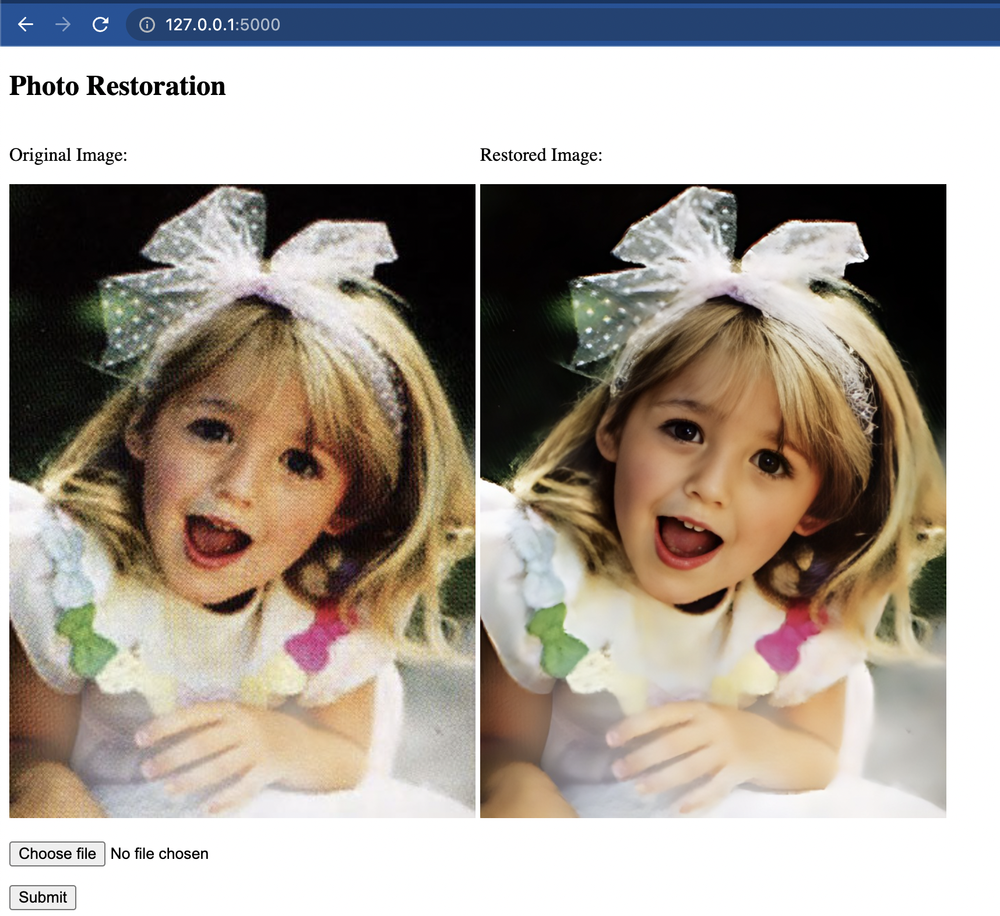

# Flask app to restore photos

Simple Flask app to restore old photos with AI. It uses the [GFPGAN](https://replicate.com/tencentarc/gfpgan) model on [Replicate](https://replicate.com/).


## Setup
```bash
pip install flask replicate python-dotenv
```

You need a [Replicate](https://replicate.com/) API Token (You can get started for free). Put the token in the `.env` file.

Then start the app, upload a photo, and have fun!

```bash
python main.py
```